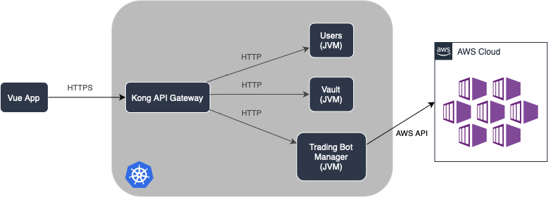

<h1 align="center">
   
  
   
  Knag
   
</h1>

<h4 align="center">An Algorithmic Trading SaaS platform for my TFG (Final Degree Project)</h4>

<!--

  

-->

  <a href="#abstract">Abstract</a> •
  <a href="#thesis-document">Thesis Document</a> •
  <a href="#repository-structure">Repository Structure</a> •
  <a href="#architecture">Architecture</a> •
  <a href="#how-to-use">How To Use</a> •
  <a href="#credits">Credits</a> •
  <a href="#license">License</a>

## Abstract

Algorithmic and automated trading is out of the scope of retail investors, due to the technical complexity of it as well as the costs of development.
Some brokers offer this service but at an upfront cost and a monthly fee. Users depend on the broker's platform and servers to execute the trades, giving the broker too much control over the user's data and trading activity.

The solution implemented in this project is a customizable FOSS automated trading platform that can be used by retail investor communities to implement their trading strategies and by individual investors to automate their trading activity.

The platform is designed to be highly scalable and available, developed with a cloud-first approach, and using the latest technologies in the field of distributed systems, such as Kubernetes and public cloud providers' specific services.

The specific implementation of the trading bot is out of the scope of this project. Nonetheless, the platform is designed to be easily extensible and customizable, through the use of docker containers.

## Thesis Document

The thesis document is available in Spanish at **LINK TO BE ADDED**.

## Repository Structure

The development environment for this project is based on the following layers:

- Provisioning of a cluster of Debian virtual machines using [Vagrant](/vagrant/README.md)

- Provisioning of the cluster using [Ansible](/ansible/README.md)

- Deployment of the platform using [Helm](/helm/README.md)

## Architecture

The system follows a micro-service architecture pattern within the Kubernetes namespace. Each service provides functionality through a REST API accessible only within the cluster. To enable external access, an API Gateway acts as a reverse proxy.

The API Gateway pattern solves complexities introduced by a micro-services architecture, such as routing, traffic management, and caching.

The Gateway handles routing, load balancing, and serves as a single entry point for clients. It simplifies client implementation by decoupling services from the client. Authentication is enforced by the Gateway through signature verification of the client's JWT (JSON Web Token), ensuring authorized access to services. Rate limiting and throttling are also managed by the Gateway to prevent system abuse.

Additionally, the Gateway manages the termination of TLS (Transport Layer Security), eliminating the need for services to have TLS certificates and offloading the computational cost associated with TLS to the Gateway.

*Figure 1: System Architecture Diagram*

The application's micro-service architecture is composed of the following components:

- [**Users**](https://github.com/zugazagoitia/knag-users): Responsible for client authentication, including login, registration, and user data updates. Users are issued a JWT signed by an authoritative certificate, enabling authentication against any service.

- [**Vault**](https://github.com/zugazagoitia/knag-vault): Stores symmetrically encrypted API keys provided by users for trading brokers. The data is decrypted using the user's password, which remains unknown to the system. The decrypted keys are then used by the trading bot.

- **Trading Bot Manager**: Manages the provisioning and monitoring of bot instances in a separate public cloud resource. This separation ensures client instances are independent and prevents resource contention. **This service is not implemented in this project**.

A [web application](https://github.com/zugazagoitia/knag-web) interacts with the exposed REST API, which remains agnostic to the internal workings of the services. The deployment and infrastructure of the user interface are separate from the services.

The clear separation between business logic and presentation mitigates the impact of service malfunctions, confining any damage to the specific service.

## Credits

Icon by: <a href="https://www.vecteezy.com/free-vector/tree-rings">Tree Rings Vectors by Vecteezy</a>

## License

[GNU Affero General Public License v3.0](/LICENSE)

---

> [zugazagoitia.com](https://www.zugazagoitia.com) &nbsp;&middot;&nbsp;
> GitHub [@zugazagoitia](https://github.com/zugazagoitia) &nbsp;&middot;&nbsp;
> LinkedIn [/in/zugazagoitia/](https://www.linkedin.com/in/zugazagoitia/)
